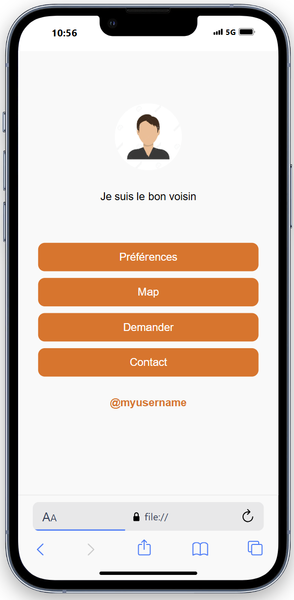

                                 Projet Hackathon Orange : Application d'Entraide Locale 

 

##  Description
Ce projet a été développé dans le cadre d'un hackathon d'une semaine organisé par Orange, en collaboration avec un groupe de quatre personnes. L'objectif était de créer une application en utilisant des API en bêta-test fournies par Orange. Le thème du projet portait sur le local, l'entraide, et la spontanéité. Ce fut ma première expérience de travail en équipe sur un projet avec des deadlines serrées, dans un environnement collaboratif où chacun devait s'impliquer dans toutes les étapes du développement.

##  Technologies utilisées
**API Orange (bêta)** : Pour intégrer des fonctionnalités uniques et pertinentes à l'application.

**HTML5, CSS3, JavaScript** : Pour le développement de l'interface utilisateur et la logique de
 l'application.

## Caractéristiques principales 

 Débat et choix d'idée :
Nous avons commencé par brainstormer plusieurs idées, puis débattu pour choisir celle qui s'alignait le mieux avec le thème du hackathon. Chaque membre a défendu son point de vue, et nous avons choisi l'idée la plus réalisable et innovante.

 Incorporation des API Orange :
Nous avons réfléchi ensemble à la manière d'intégrer les API en bêta fournies par Orange dans notre idée d'application, afin de maximiser leur potentiel et leur utilité dans le contexte du projet.

 Répartition des tâches :
Les tâches ont été réparties de manière équilibrée, mais chacun a eu l'occasion de toucher à différentes parties du projet (développement, intégration, design, etc.), ce qui nous a permis de mieux comprendre les différentes facettes du développement d'une application.

 Environnement de travail collaboratif :
Cette expérience m'a plongé dans un environnement de travail réaliste, où le respect des deadlines et la collaboration étroite entre les membres de l'équipe étaient essentiels pour mener à bien le projet.

 Création d'un Canvas explicatif :
Nous avons créé une présentation Canvas pour expliquer l'idée, le fonctionnement, et les détails techniques de l'application. Voici le lien vers notre canvas : [Ici](https://www.canva.com/design/DAGXA20tEyc/Ve0QFC0k62XC3ExfyskoEg/edit)

 Remarque importante :
Il est inutile de tester cette application sur un ordinateur, car les API en bêta-test utilisées ne seront probablement plus d'actualité au moment de la lecture de cette description. Par conséquent, certaines fonctionnalités pourraient ne plus fonctionner correctement.

## 🛠 Processus de développement

**Idéation** : Brainstorming, débat, et sélection de l'idée finale.

**Planification** : Réflexion sur l'intégration des API et définition des étapes du projet.

**Développement** : Répartition des tâches, développement collaboratif, intégration des API.

**Présentation** : Création et présentation du canvas explicatif pour illustrer le projet et sa réalisation.
